# Отчет по практической работе №1

# Студент: [ФИО]

## Группа: [номер группы]

## Дата выполнения: [23.03.2026]

## Ссылка на репо: https://github.com/some0person/containers-lab-1

### 1. Выполненные команды Docker

#### 1.1 Работа с образами

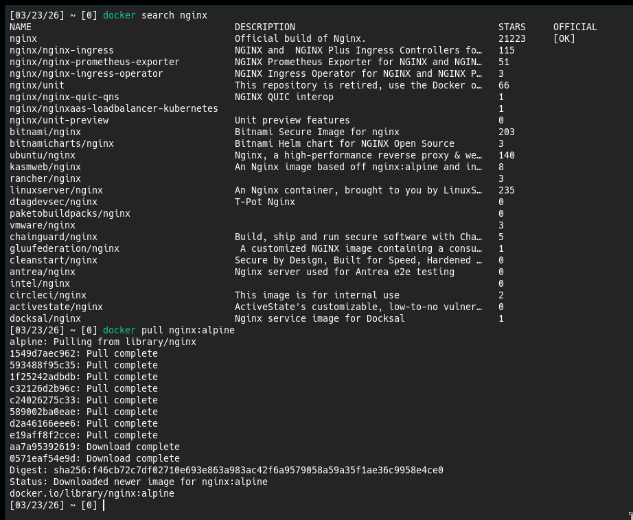

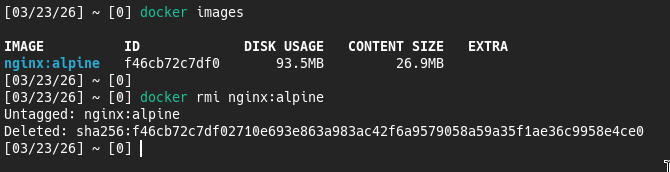

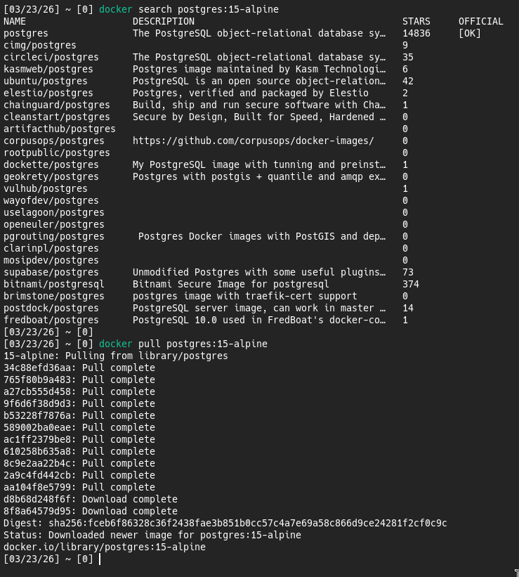

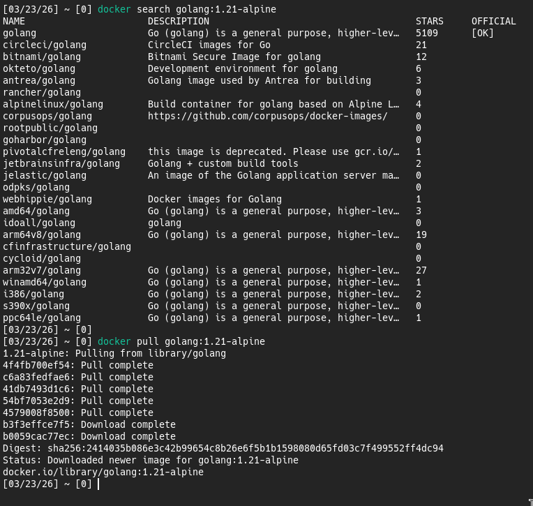

#### 1.2 Работа с контейнерами

##### Задание 1.2.1: Запустите и управляйте контейнерами

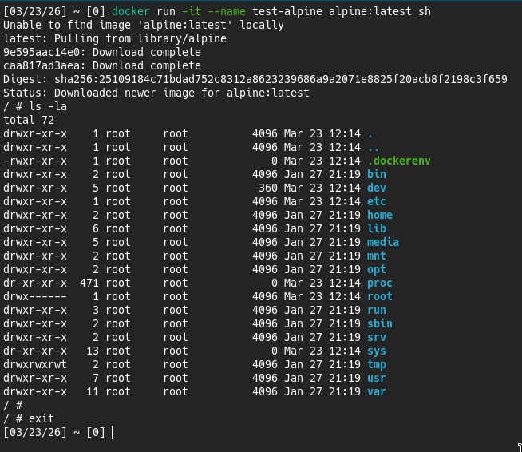

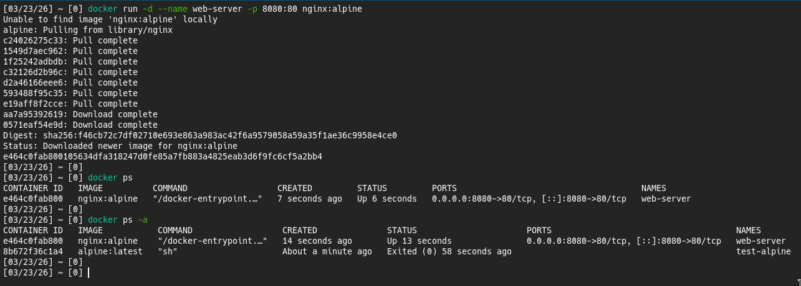

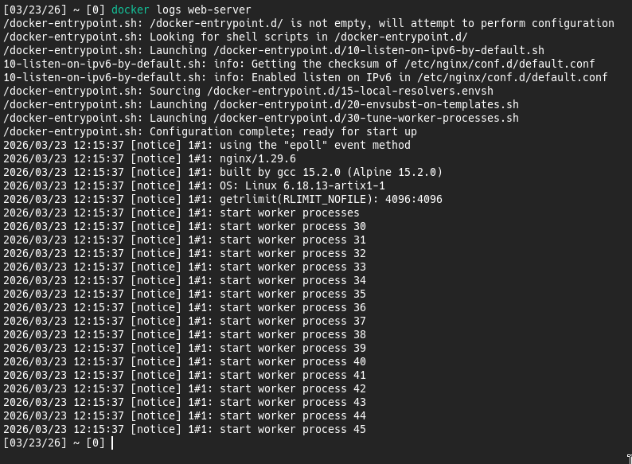

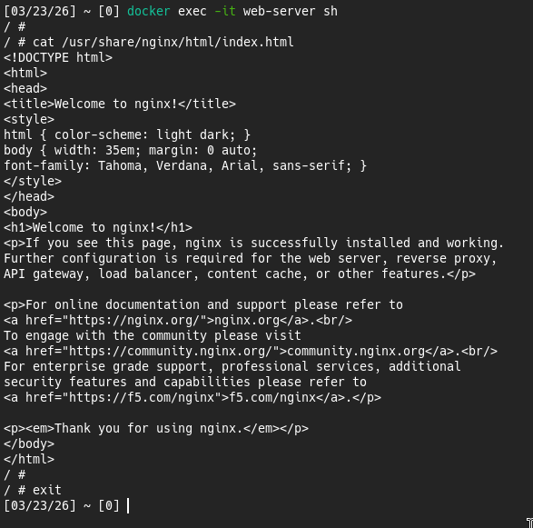

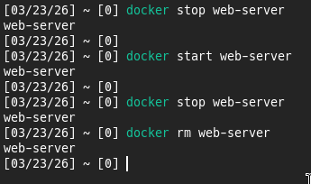

##### Задание 1.2.2: Практическое задание

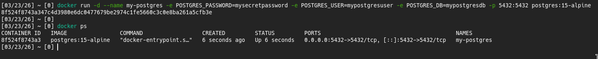

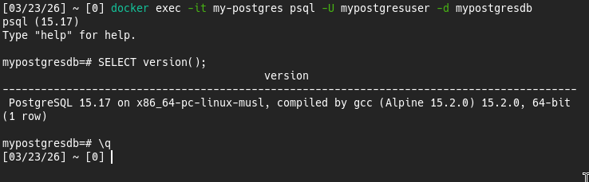

#### 1.3 Работа с томами

##### Задание 1.3.1: Сохраните данные вне контейнера

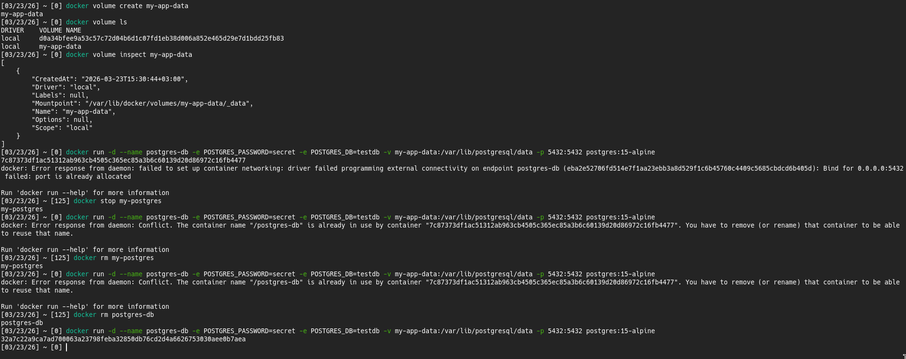

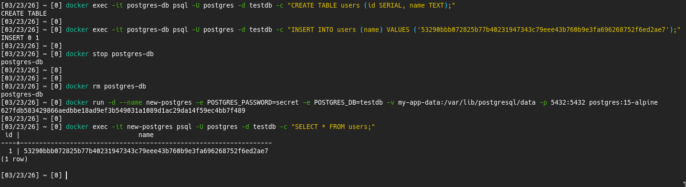

##### Задание 1.3.2: Практическое задание

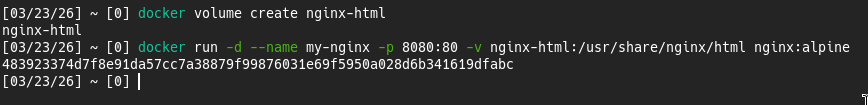

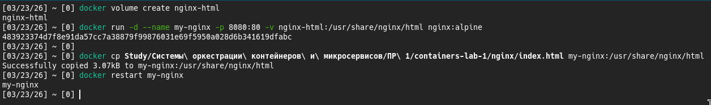

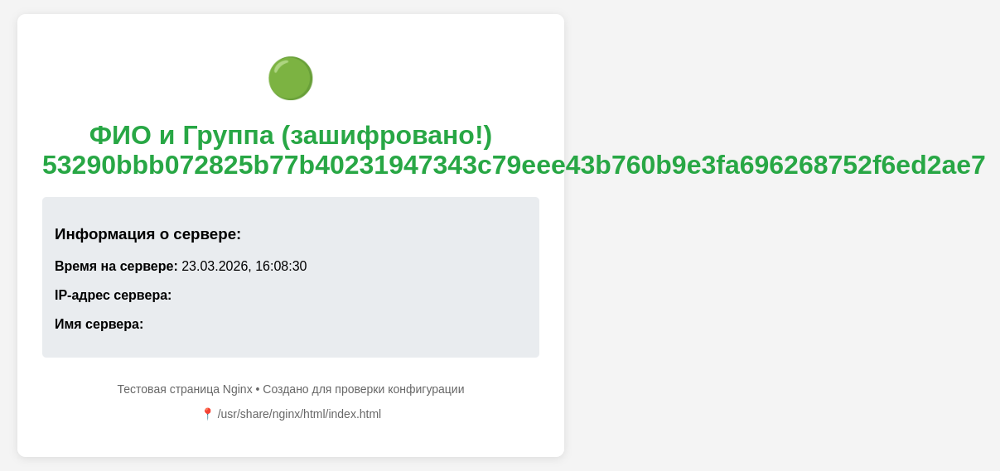

#### 1.4 Сеть в Docker

##### Задание 1.4.1: Создайте изолированную сеть для взаимодействия контейнеров

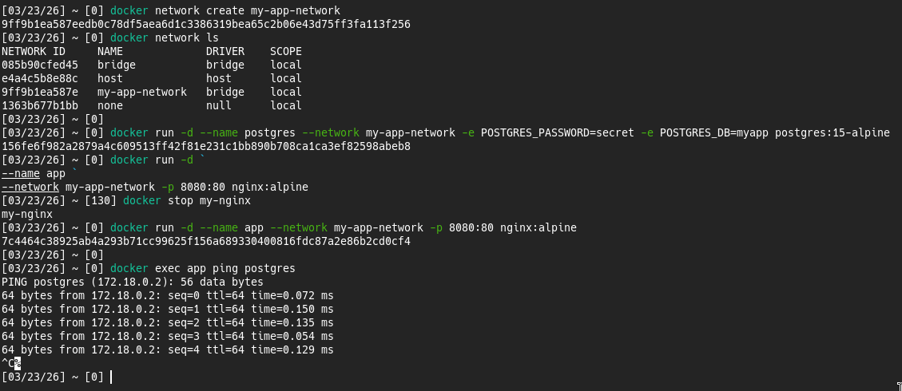

##### Практическое задание

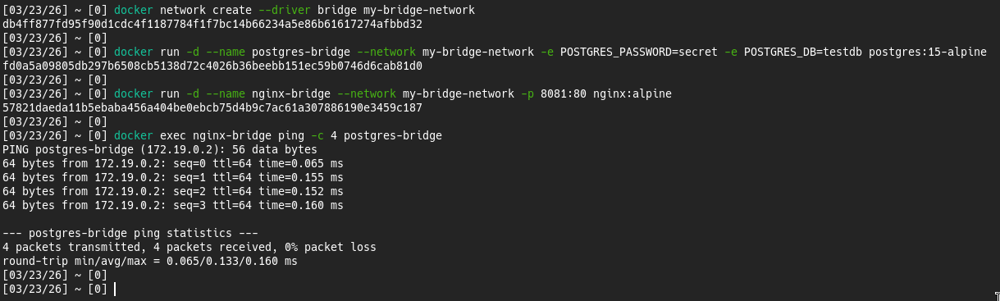

### 2. Скриншоты работающего приложения

#### 2.1 Главная страница

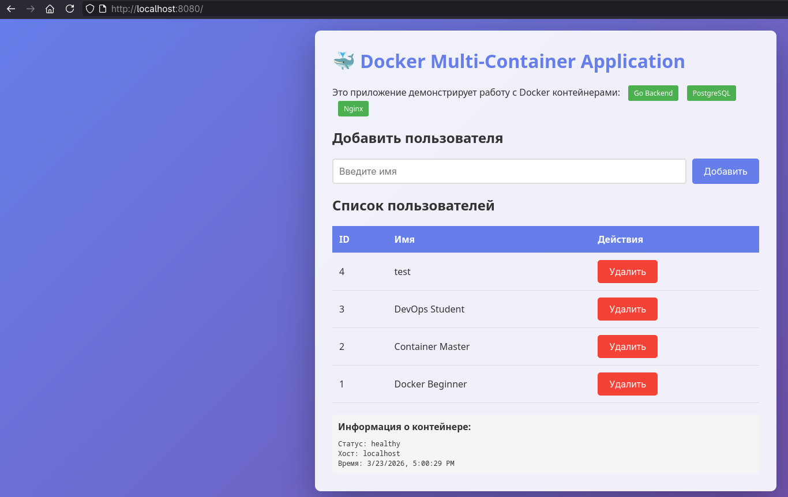

#### 2.2 Добавление пользователя

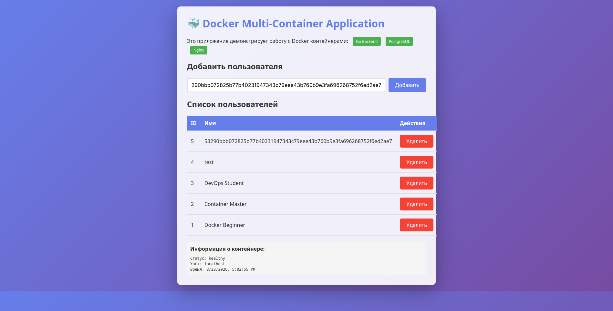

#### 2.3 Список пользователей в БД

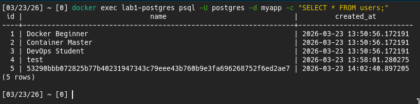

### 3. GitHub Actions

#### 3.1 Успешный запуск workflow

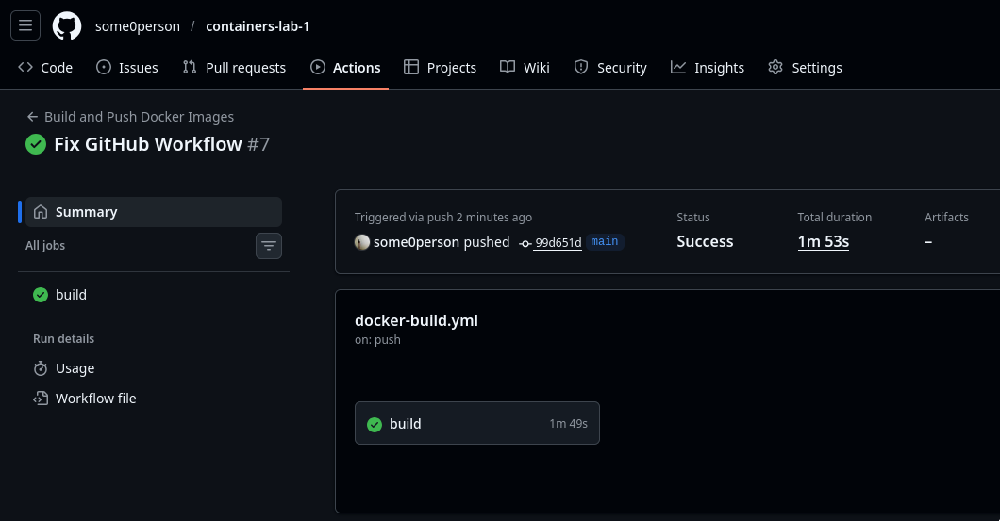

#### 3.2 Опубликованные образы в GHCR

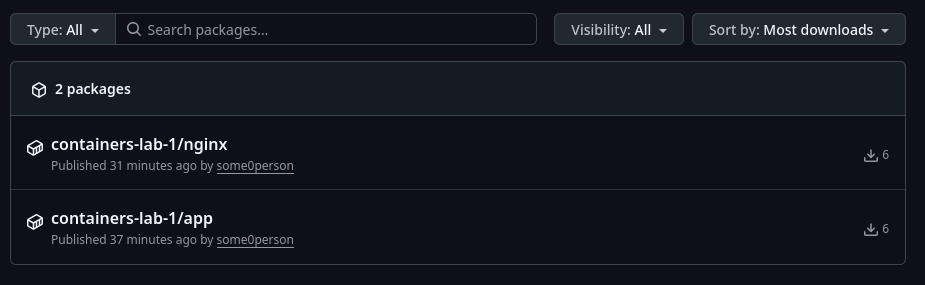

### 4. Выводы

[Опишите, что нового узнали, с какими трудностями столкнулись]

